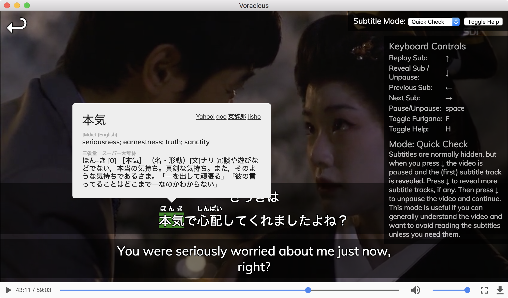

# Voracious

### [Download Voracious *(alpha)*](https://github.com/rsimmons/voracious/releases)

Voracious is a video player app for Mac/Windows/Linux with special features for studying foreign languages (esp. Japanese).



Voracious lets you:
- **Scan and browse** your media collection ala Kodi or Plex
- Simultaneously display **multiple subtitle tracks** (SRT, VTT, ASS)
- Quickly **replay** the current subtitle and navigate forward and back *by subtitle* using the keyboard
- Train your listen/reading/comprehension with **special viewing modes** that automatically pause and hide/reveal subtitles
- Automatically generate **furigana** annotations _(Japanese only)_
- Hover over words to see **dictionary definitions** _(Japanese only)_
- Import and use **EPWING** dictionaries _(limited to certain popular Japanese EPWINGs)_
- _(coming soon)_ **Export subtitles as sentence cards** to Anki (with audio, ala subs2srs), instantly via AnkiConnect
- _(coming soon)_ **Search for words/phrases** over your entire library of subtitles

# Using Voracious (Quick Start)

Before using Voracious, you need to have a media collection that's organized and named the same way you would for Kodi or Plex _(each show/movie in its own directory, subtitle filename matching video filenames, etc.)_. Note that Voracious can **only play .mp4 videos** currently. Also, keep in mind that Voracious won't be useful unless you have subtitles in the language you're trying to learn.

If your media collection is ready to go, open Voracious and hit the *Add Collection* link. Select the folder where your collection lives, and give it name, and add it. On the Library page, you can browse your collection and play videos (videos without any available subtitles will appear grey). In the player, check the help overlay for keyboard controls, and try different subtitle modes.

# Development

## Overview and repo structure

Voracious is mostly built as a single-page web app with React (using `create-react-app`), and then packaged as a cross-platform desktop app using Electron. As with a normal `create-react-app`-based app, the bulk of the code is in `src/` with some static resources in `public/`. The output of webpack (after `yarn react-build`) will go into `build/`. Electron-builder is used to package the resulting build into an Electron-based app, with its output going to `dist/`.

The `app/` dir contains a small amount of code and config related to Electron. The main Electron entry point is `app/electron-main.js`, and `app/package.json` is the `package.json` that's distributed in the final app.

Most third-party dependencies are pure JS (`react`, `immutable`, etc.) and are declared in the root `package.json`. Those are bundled with the the Voracious code (by webpack) into a single JS file. That means that the root `node_modules/` does _not_ needed to be distributed with the final Electron app. This sort of bundling isn't generally necessary to do for Electron apps, but it's convenient for various reasons.

Dependencies that use native code (e.g. `sqlite`) need to be compiled against the Electron V8 runtime, and are declared in `app/package.json`. The corresponding `app/node_modules/` _is_ packaged into the final distributed Electron app.

Electron-builder is configured via `electron-builder.json`. The current config has it basically combine the contents of `build/` and `app/` to form the distributed archive.

## Installing for development

To install for development you'll first need NodeJS, Yarn, and some extra build tools for node-gyp ([see here](https://github.com/nodejs/node-gyp)). Then:

```
$ yarn # install pure-JS and development dependencies
$ cd app
$ yarn # install dependencies that include native code in app/ subdir
$ cd ..
$ yarn rebuild-native # rebuild native deps in app/node_modules against correct Electron V8 runtime
```

## Running in development mode

Start the React development server with:
```
$ yarn react-start
```

Once the React server has started up, **in a separate terminal** run:
```
$ yarn electron-start
```

The Electron app will open, with the main window serving from the development server (localhost:3000). Edits to the source will cause it to automatically reload.

## Building for release

First build the JS:
```
$ yarn react-build
```

Then build the distributable desktop app:
```
$ yarn dist
```

The output archive/executable can then be found in the `dist` dir.

If you just want to run the built app and don't need it packed into an archive/executable for distribution, then run:

```
$ yarn dist-nopack
```

## Inspecting the distributed archive

It's often useful to check exactly what files have been included in the archive distributed with the Electron app. An easy way to do that is to install the `asar` tool (`yarn global add asar`) and then (on mac) run:

```$ asar list dist/mac/Voracious.app/Contents/Resources/app.asar```
